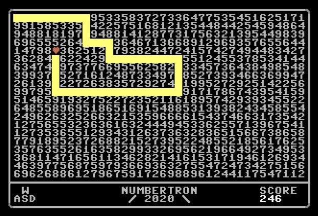

# Numbertron (game)

The concept for this game was stolen from https://spillhistorie.no/2019/07/01/post-mortem-numbertron/  

This is a simplified version created in C64 BASIC.

Open `numbertron.prg` in the emulator and have fun! Or run the source code through my C64 BASIC converter: https://github.com/mkeke/c64-basic-converter

## Objective

  
Screenshot  

Move the red heart using WASD. The first number in the chosen direction dictates how many steps you take in that direction. You get points for each value along the way. If you move too far off the board, or intercept your own tail, the game is up.
